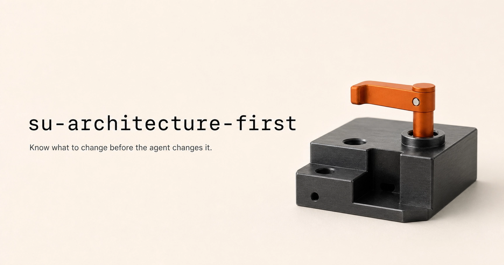

<p align="center">
  
</p>

# su-architecture-first

<p align="center">
  <strong>English</strong> · <a href="./README.zh-CN.md">简体中文</a>
</p>

A lightweight architecture-first Agent Skill for anyone using Codex or another coding agent to make engineering changes—from small fixes and ordinary features to recurring failures and system changes.

It helps the agent locate the real goal, owning layer, source of truth, root cause, correct change type, and validation evidence before changing the system.

Clear local tasks get a lightweight preflight and move directly into implementation. Full structural analysis is reserved for recurring problems, cross-layer changes, conflicting sources of truth, or high-risk work. This is a decision preflight—not a reason to draw the whole system or a substitute for a task-specific technology comparison.

## Quick install

Give this one sentence to an agent that can access GitHub and install local Skills:

```text
Install the Agent Skill from https://github.com/doublesq97-ui/su-architecture-first for my user account, keep the whole skill directory together, and verify that su-architecture-first is discoverable.
```

## Git clone

Clone or download the repository, then place the complete `su-architecture-first` folder in the personal or project Skills directory recognized by your agent:

```bash
git clone https://github.com/doublesq97-ui/su-architecture-first
```

Keep `SKILL.md`, `agents/`, and `references/` together, then reload the agent if it does not discover the Skill immediately.

## Who it is for

> **Anyone using Codex or another coding agent to make engineering changes.**

- **Solo developers and independent creators** building features, fixing small issues, automating work, or maintaining personal projects.
- **Software engineers and full-stack developers** developing features, fixing bugs, refactoring code, or changing system behavior.
- **Product engineers and technical founders** balancing user value, product structure, and engineering implementation.
- **Project maintainers and technical leads** dealing with recurring problems, accumulated patches, conflicting state, or unclear ownership.
- **AI application and agent-product developers** building AI workbenches, multi-agent systems, file processing, or execution workflows.
- **Automation and internal-tool developers** clarifying flows, state, executors, result return, and save locations.
- **Engineering teams collaborating with coding agents** seeking consistent preflight decisions, change classification, and regression standards.

## What it does

- Confirms the outcome before solving a nearby problem.
- Inspects the existing system and its authoritative sources.
- Locates the owning layer and responsible object.
- Treats recurring failures as structural until evidence says otherwise.
- Checks whether proven wrong, obsolete, duplicate, or superseded logic can be safely removed before adding more; deletion is never automatic.
- Distinguishes delete, refactor, implement, hide, copy, and UI work.
- Defines acceptance and regression evidence before mutation.
- Keeps internal AI and workflow complexity out of normal user work.
- Closes the loop for visible outputs, execution, return, and saving.
- Uses only as much architecture representation as the decision needs.

The Skill is complete on its own. Its runtime core is plain `SKILL.md` plus Markdown references, using relative links and no scripts, MCP servers, absolute local paths, vendor-only tools, private overlay, or companion Skill. Clients that support file-based Agent Skills can use the same folder unchanged; only installation, discovery, and tool permissions vary by client.

Clients without a native Skill loader can still use the repository as an instruction bundle: attach the files and ask the agent to read `SKILL.md` first. In that mode, persistence and automatic activation depend on the client.

## Trigger it

Natural-language prompt:

```text
Use architecture-first reasoning for this problem. First infer my real intent from the available context. Only if a material uncertainty could change the outcome, pause to ask me, with at most two questions in one clarification turn. If I am unsure, do not repeat the same question; guide me with concrete options, examples, or tradeoffs until we agree on the goal, scope, and task granularity, then start the work.
```

If a request contains the Chinese phrase `架构优先`—including `用架构优先的方式看这个问题`—invoke this Skill without requiring the user to name it.

Or invoke it directly:

```text
/su-architecture-first Use architecture-first reasoning for this problem.
```

### Automatic activation

Even without an explicit architecture-first phrase, the Skill should activate when:

- the same problem recurs or previous fixes keep failing;
- patches, duplicate logic, or workarounds are accumulating;
- state or sources of truth conflict;
- the owning layer, responsible object, or correct change type is unclear;
- a change crosses layers or carries material migration, data, permission, or user-flow risk;
- internal AI or workflow complexity is becoming a user obligation.

## Example requests

For a small, clear change:

```text
架构优先：给设置页增加导出按钮。目标和归属明确的话，快速判断后直接做。
```

For a recurring problem:

```text
/su-architecture-first Find why this task state keeps diverging, choose the owning layer, and define regression evidence before changing code.
```

For an authorized implementation:

```text
直接开工，但先做最小充分的架构判断；不要重复询问实施授权。
```

## References

The core decision path stays in `SKILL.md`. Focused references load only when needed:

- system layers and sources of truth;
- structural diagnosis for recurring problems;
- change-type classification and ordering;
- acceptance and regression design;
- AI workbench and Chat-first patterns.

The root English `SKILL.md` is the discoverable runtime Skill.

Tested with realistic product and engineering scenarios.

## License

This project is licensed under the [MIT License](LICENSE).

Copyright © 2026 Su 𝕏 @Sukiea1008 / doublesq.
