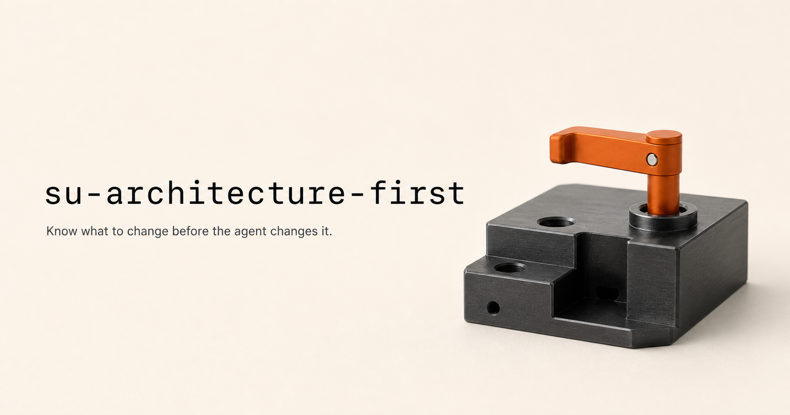

<p align="center">
  
</p>

# su-architecture-first

<p align="center">
  <a href="./README.md">English</a> · <strong>简体中文</strong>
</p>

一个轻量的架构优先 Agent Skill，面向所有使用 Codex 或编码 Agent 进行工程变更的人：从小修复、普通功能和局部重构，到复发故障与系统级改造都可以使用。

它帮助 Agent 在改动系统前确认真实目标、责任层、唯一事实源、根因、正确的变更类型和验证证据。

清楚的局部任务走轻量预检后直接开工；只有遇到复发、跨层、事实源冲突或高风险变更时，才展开完整结构分析。它是一道决策预检，不是为了画完整系统全图，也不能替代针对具体任务的技术方案比较。

## 快速安装

把下面这句话发给能够访问 GitHub 并安装本地 Skill 的 Agent：

```text
请把 https://github.com/doublesq97-ui/su-architecture-first 里的 Agent Skill 安装到我的个人 Skill 目录，完整保留整个 Skill 文件夹，并确认 su-architecture-first 已能被发现。
```

## Git clone

克隆或下载仓库，再把完整的 `su-architecture-first` 文件夹放进当前 Agent 能识别的个人或项目 Skill 目录：

```bash
git clone https://github.com/doublesq97-ui/su-architecture-first
```

请保持 `SKILL.md`、`agents/` 和 `references/` 在同一个目录中。如果 Agent 没有立即发现 Skill，重新加载一次。

## 谁适合使用

> **所有使用 Codex 或编码 Agent 进行工程变更的人。**

- **个人开发者与独立创作者**：用 Codex 完成功能、小修复、自动化或个人项目。
- **软件工程师与全栈开发者**：开发功能、修 Bug、重构代码或调整系统行为。
- **产品工程师与技术型创业者**：需要同时判断用户价值、产品结构与工程实现。
- **项目维护者与技术负责人**：面对复发问题、补丁累积、状态冲突和责任边界不清。
- **AI 应用与 Agent 产品开发者**：构建 AI 工作台、多 Agent 系统、文件处理或执行工作流。
- **自动化与内部工具开发者**：需要厘清流程、状态、执行者、结果返回和保存位置。
- **使用编码 Agent 协作的工程团队**：希望形成一致的开工判断、变更分类和回归标准。

## 它能做什么

- 先确认结果，避免解决成相邻但不同的问题。
- 检查现有系统和权威事实源。
- 定位真正负责的层与对象。
- 在证据证明并非如此前，把复发问题优先当作结构问题调查。
- 增加逻辑前，先检查有证据证明错误、过时、重复或已被替代的逻辑能否安全移除；删除从来不是自动答案。
- 区分删除、重构、实现、隐藏、文案修改和 UI 优化。
- 改动前定义验收与回归证据。
- 不把 AI 与工作流的内部复杂度转嫁给普通用户。
- 让用户可见的产物、执行、返回与保存形成闭环。
- 只使用当前决策真正需要的架构表达深度。

这个 Skill 本身就是完整能力。运行核心只有 `SKILL.md` 和 Markdown 参考资料，全部使用相对路径；不含脚本、MCP 服务、本机绝对路径、厂商专用工具、私人增强或配套 Skill。支持文件型 Agent Skill 的客户端可以原样使用同一个文件夹，不同平台主要只差安装入口、发现机制和工具权限。

尚未提供原生 Skill 加载器的客户端，也可以把仓库作为指令包使用：上传这些文件，并要求 Agent 先读取 `SKILL.md`。在这种模式下，能否长期保存和自动触发取决于客户端本身。

## 主动触发

推荐直接使用这句自然语言：

```text
用架构优先的方式看这个问题。先结合现有信息理解我的真实意图；只有仍存在会改变结果的关键不确定时，停下来向我确认，每轮最多问两个问题。如果我也不确定，不要重复追问同一个问题，请用具体选项、例子或取舍继续引导，直到我们对目标、范围和任务颗粒度达成一致，然后直接开工。
```

只要用户请求中出现“架构优先”四个字——包括“用架构优先的方式看这个问题”——就调用这个 Skill，不要求用户再写 Skill 名称。

### 被动触发

即使用户没有主动说“架构优先”，出现以下情况时也应自动调用：

- 同一个问题反复出现，或之前的修复不断失效；
- 补丁、重复逻辑或临时绕行方案持续累积；
- 状态或唯一事实源彼此冲突；
- 责任层、责任对象或正确的变更类型不清楚；
- 变更跨越多个层级，或涉及迁移、数据、权限、关键用户流程等较高风险；
- AI 或工作流的内部复杂度正在变成用户必须理解和操作的负担。

## 请求示例

小而明确的改动：

```text
架构优先：给设置页增加导出按钮。目标和归属明确的话，快速判断后直接做。
```

反复出现的问题：

```text
用 su-architecture-first 找出任务状态反复不一致的原因，确认责任层，并在改代码前定义回归证据。
```

已经授权的实施：

```text
直接开工，但先做最小充分的架构判断；不要重复询问实施授权。
```

## 参考资料

稳定的判断主线保留在 `SKILL.md`。以下参考资料只在对应情况出现时加载：

- 系统分层与唯一事实源；
- 复发问题的结构性诊断；
- 变更类型与实施顺序；
- 验收与回归设计；
- AI 工作台与 Chat-first 模式。

完整中文对照内容位于 [docs/zh-CN](docs/zh-CN/)，其中包括 [Skill 本体中文对照版](docs/zh-CN/SKILL.zh-CN.md)。仓库根目录的英文 `SKILL.md` 始终是唯一会被发现的 Skill。

已使用真实的产品与工程场景进行测试。

## 许可证

本项目使用 [MIT License](LICENSE)。

Copyright © 2026 Su 𝕏 @Sukiea1008 / doublesq.
